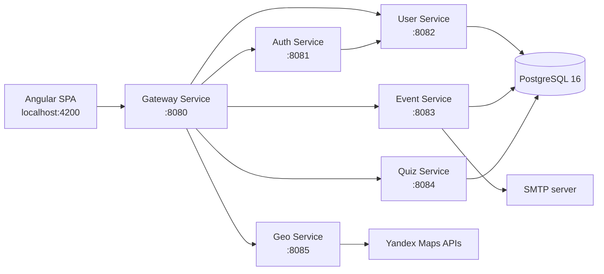

# Event Portal

Full-stack платформа для создания, публикации и проведения мероприятий. Backend построен как набор независимых Spring Boot микросервисов, frontend — SPA на Angular.

Проект развился из [монолитной версии Event Portal](https://github.com/andrey8080/event-portal-monolit): текущий репозиторий показывает следующий этап архитектуры с разделением backend на сервисы, единым gateway и независимыми CI-пайплайнами для frontend и backend.

[](https://github.com/andrey8080/event-portal-microservices/actions/workflows/backend-ci.yml)
[](https://github.com/andrey8080/event-portal-microservices/actions/workflows/frontend-ci.yml)

## Возможности

- регистрация и авторизация пользователей по JWT;
- роли `PARTICIPANT`, `ORGANIZER` и `ADMIN`;
- просмотр и редактирование профиля пользователя;
- создание, редактирование и удаление мероприятий;
- категории, теги, изображения, лимит участников, стоимость и географические координаты события;
- регистрация на мероприятие и отмена регистрации;
- просмотр участников организатором;
- отзывы и оценки мероприятий;
- автоматический расчёт статистики по количеству участников и среднему рейтингу;
- email-рассылки участникам мероприятия;
- создание и прохождение квизов, хранение результатов;
- поиск адресов и организаций через API Яндекс Карт;
- отдельный dashboard организатора;
- единая точка входа в backend через gateway-service;
- OpenAPI-спецификации для публичного REST API.

## Архитектура



`gateway-service` реализует HTTP-проксирование запросов к остальным сервисам. Для frontend достаточно одного backend URL — `http://localhost:8080`.

### Backend-сервисы

| Сервис | Порт | Основные маршруты | Назначение |
|---|---:|---|---|
| `gateway-service` | `8080` | `/auth/**`, `/users/**`, `/events/**`, `/quizzes/**`, `/api/geo/**`, `/geo/**` | единая точка входа и маршрутизация запросов |
| `auth-service` | `8081` | `/auth/**` | регистрация, вход, проверка JWT |
| `user-service` | `8082` | `/users/**`, `/internal/users/**` | пользователи, профиль, роли и инициализация схемы БД |
| `event-service` | `8083` | `/events/**` | события, регистрации, участники, отзывы, статистика и рассылки |
| `quiz-service` | `8084` | `/quizzes/**` | квизы, вопросы, ответы и результаты |
| `geo-service` | `8085` | `/api/geo/**`, `/geo/**` | геокодирование и поиск через Яндекс Карты |

PostgreSQL внутри Docker Compose работает на стандартном порту `5432`, а на хост пробрасывается как `localhost:5433`.

## Стек

### Backend

- Java 21
- Spring Boot 3.2.2
- Spring Web
- Spring Security
- Spring Data JPA
- Spring JDBC / `JdbcTemplate`
- Spring Mail
- JWT (`jjwt` 0.11.5)
- PostgreSQL 16
- Gradle
- Docker / Docker Compose

### Frontend

- Angular 17
- TypeScript 5.4
- RxJS 7
- Angular Router
- Angular Reactive Forms

### CI

- GitHub Actions
- Temurin JDK 21 для backend pipeline
- Node.js 20 для frontend pipeline

## Структура репозитория

```text
event-portal-microservices/
├── .github/
│   └── workflows/
│       ├── backend-ci.yml
│       └── frontend-ci.yml
├── back/
│   ├── auth-service/
│   ├── user-service/
│   ├── event-service/
│   ├── quiz-service/
│   ├── geo-service/
│   ├── gateway-service/
│   ├── docker-compose.yml
│   ├── openapi.yaml
│   ├── build.gradle
│   └── settings.gradle
└── front/
    ├── src/
    ├── angular.json
    └── package.json
```

## Быстрый запуск

### Требования

Для самого простого сценария нужны:

- Docker;
- Docker Compose;
- Node.js 20+;
- npm.

Java и локальный PostgreSQL не требуются, если backend запускается через Docker Compose.

### 1. Клонировать репозиторий

```bash
git clone https://github.com/andrey8080/event-portal-microservices.git
cd event-portal-microservices
```

### 2. Настроить backend

```bash
cd back
cp .env.example .env
```

Для базового локального запуска можно оставить значения по умолчанию. Для геопоиска и email-рассылок необходимо заполнить соответствующие ключи и SMTP-настройки.

### 3. Запустить backend

```bash
docker compose up --build
```

После запуска:

- gateway: `http://localhost:8080`
- auth-service: `http://localhost:8081`
- user-service: `http://localhost:8082`
- event-service: `http://localhost:8083`
- quiz-service: `http://localhost:8084`
- geo-service: `http://localhost:8085`
- PostgreSQL: `localhost:5433`

При старте `user-service` автоматически создаёт необходимые таблицы, ограничения, индексы, PostgreSQL-триггеры и функции для чистой базы данных.

### 4. Запустить frontend

В отдельном терминале:

```bash
cd front
npm ci
npm start
```

Приложение будет доступно по адресу:

```text
http://localhost:4200
```

Frontend в development-конфигурации обращается к gateway по адресу `http://localhost:8080`.

### Остановка backend

```bash
cd back
docker compose down
```

Чтобы также удалить локальный PostgreSQL volume:

```bash
docker compose down -v
```

## Переменные окружения

Пример находится в [`back/.env.example`](./back/.env.example).

| Переменная | Назначение | Значение по умолчанию |
|---|---|---|
| `JWT_SECRET` | секрет для подписи JWT | `change-me` |
| `JWT_EXPIRATION` | время жизни JWT в миллисекундах | `86400000` |
| `POSTGRES_DB` | имя базы данных | `eventportal` |
| `DB_USER` | пользователь PostgreSQL | `andrey` |
| `DB_PASSWORD` | пароль PostgreSQL | `postgres` |
| `APP_CORS_ALLOWED_ORIGINS` | разрешённый origin frontend | `http://localhost:4200` |
| `YANDEX_MAPS_API_KEY` | ключ API Яндекс Карт | пусто |
| `YANDEX_MAPS_SEARCH_API_KEY` | ключ Search API Яндекс Карт | пусто |
| `MAIL_HOST` | SMTP host | `smtp.yandex.ru` |
| `MAIL_PORT` | SMTP port | `465` |
| `MAIL_USER` | SMTP login | пусто |
| `MAIL_PASSWORD` | SMTP password | пусто |

> Для окружения, отличного от локальной разработки, обязательно замените значения `JWT_SECRET`, `DB_PASSWORD` и другие секреты. Не коммитьте рабочий `.env` в репозиторий.

## REST API

Агрегированная OpenAPI-спецификация находится в [`back/openapi.yaml`](./back/openapi.yaml). Отдельные контракты также лежат внутри каталогов соответствующих сервисов.

Основные endpoints:

| Method | Endpoint | Описание |
|---|---|---|
| `POST` | `/auth/signup` | регистрация |
| `POST` | `/auth/signin` | авторизация |
| `GET` | `/users/me` | профиль текущего пользователя |
| `PUT` | `/users/me/role` | смена роли пользователя |
| `GET` | `/events` | список мероприятий |
| `POST` | `/events` | создание мероприятия |
| `GET` | `/events/{id}` | информация о мероприятии |
| `PUT` | `/events/{id}` | редактирование мероприятия |
| `DELETE` | `/events/{id}` | удаление мероприятия |
| `POST` | `/events/{id}/registrations` | регистрация на мероприятие |
| `DELETE` | `/events/{id}/registrations/me` | отмена своей регистрации |
| `GET` | `/events/{id}/participants` | участники мероприятия |
| `POST` | `/events/{id}/feedback` | добавить отзыв и оценку |
| `GET` | `/events/{id}/feedback/middle-score` | средняя оценка мероприятия |
| `POST` | `/events/{id}/newsletter` | рассылка участникам |
| `POST` | `/quizzes` | создание квиза |
| `GET` | `/quizzes/{quizId}/questions` | вопросы квиза |
| `POST` | `/quizzes/{quizId}/results` | сохранение результата |
| `GET` | `/api/geo/geocode` | геокодирование адреса |
| `GET` | `/api/geo/search` | поиск объектов на карте |

Защищённые endpoints используют заголовок:

```http
Authorization: Bearer <JWT>
```

## Сборка и тесты

### Backend

```bash
cd back
./gradlew clean build
```

Проект является Gradle multi-project build, поэтому команда собирает и запускает тесты всех backend-сервисов.

### Frontend

```bash
cd front
npm ci
npm run build -- --configuration production
```

## CI/CD

В репозитории настроены два независимых GitHub Actions workflow:

- **Backend CI** — запускает `./gradlew clean build` на Java 21 при изменениях в `back/**`;
- **Frontend CI** — устанавливает зависимости через `npm ci` и собирает production bundle на Node.js 20 при изменениях в `front/**`.

Это позволяет проверять frontend и backend независимо друг от друга и не запускать лишние pipeline jobs при изменениях только в одной части проекта.

## Основные пользовательские сценарии

### Участник

1. Регистрируется и входит в систему.
2. Просматривает доступные мероприятия.
3. Открывает карточку мероприятия и регистрируется на него.
4. При необходимости отменяет регистрацию.
5. Проходит привязанный к мероприятию квиз.
6. Оставляет отзыв и оценку.

### Организатор

1. Переключает аккаунт в роль организатора.
2. Создаёт и редактирует мероприятия.
3. Просматривает список зарегистрированных участников.
4. Следит за количеством участников и средней оценкой.
5. Создаёт квизы для мероприятий.
6. Отправляет email-рассылки участникам.
